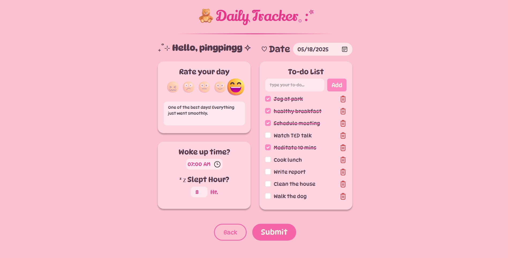
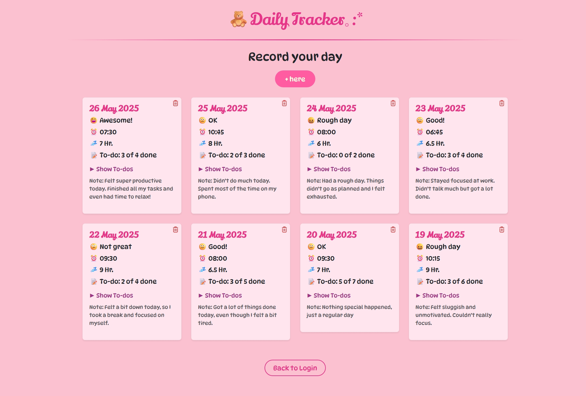

# 🧸 Daily Tracker｡:*

A cute and simple web application for tracking your daily routines, mood, sleep, and tasks — all in one place. Built with React + TypeScript and styled with a soft pink aesthetic.

## 📸 Screenshot
Form Page

Records Page



## ✨ Features

- 🌤 Record your mood, wake-up time, and sleep hours
- ✅ Create to-do lists for each day
- 💬 Add notes to reflect on your day
- 📅 View all past entries in the **Record Page**
- 🗑 Delete specific records anytime
- 🧠 Data saved in `localStorage`, separated per user
- 🎨 UI interactions with SweetAlert2 and custom CSS animations
- 📱 Responsive design – usable on mobile, tablet, and desktop

## 🛠 Technologies
- React
- TypeScript
- React Hook Form
- Zod - for schema validation
- SweetAlert2
- Bootstrap 5

## 🚀 Getting Started
### Prerequisites
- [Node.js](https://nodejs.org/)  (v20.12.2)
- [npm](https://www.npmjs.com/)  (v10.5.0)
- [Git](https://git-scm.com/)  (v2.40+)

### Clone and Run
```bash
git clone https://github.com/piingping/daily-tracker.git
cd daily-tracker
npm install
npm run dev

